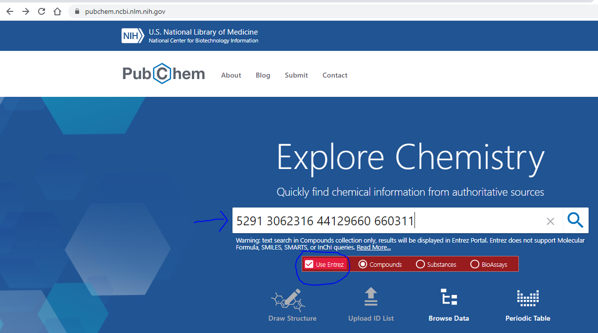

## Searching PubChem for compounds

You can search PubChem wih the name of a compound (Ex. Imatinib). If you want to search for a list, you have to create a **file** with **one id per line** and upload it via "Upload ID list" PubChem link. Here is a list for the four molecules discussed in the paper. You can also cut and paste the ids directly into the PubChem box (see below).

5291  
3062316  
44129660  
660311
 
PubChem Search: 
